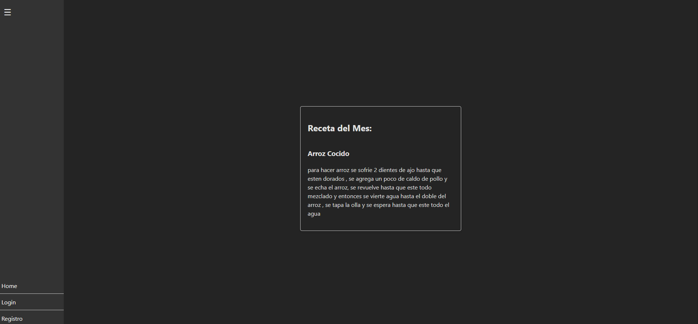
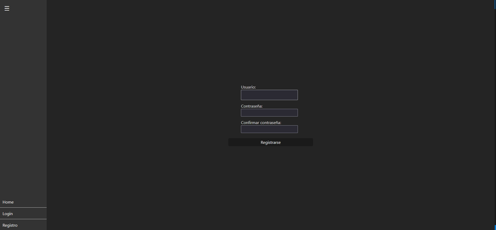
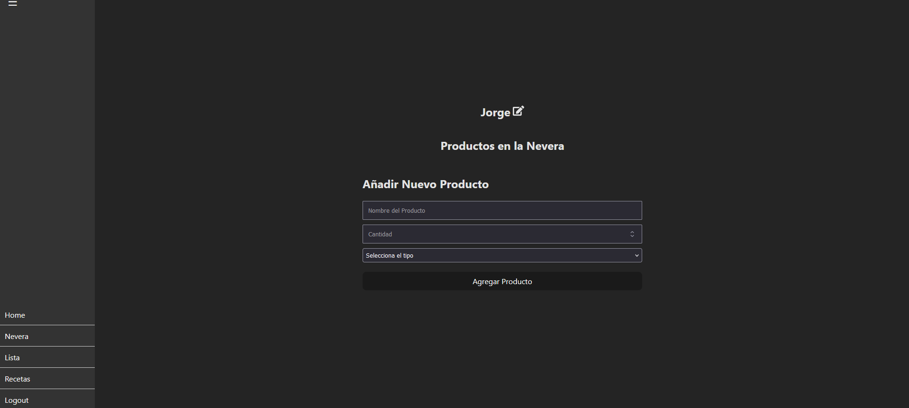
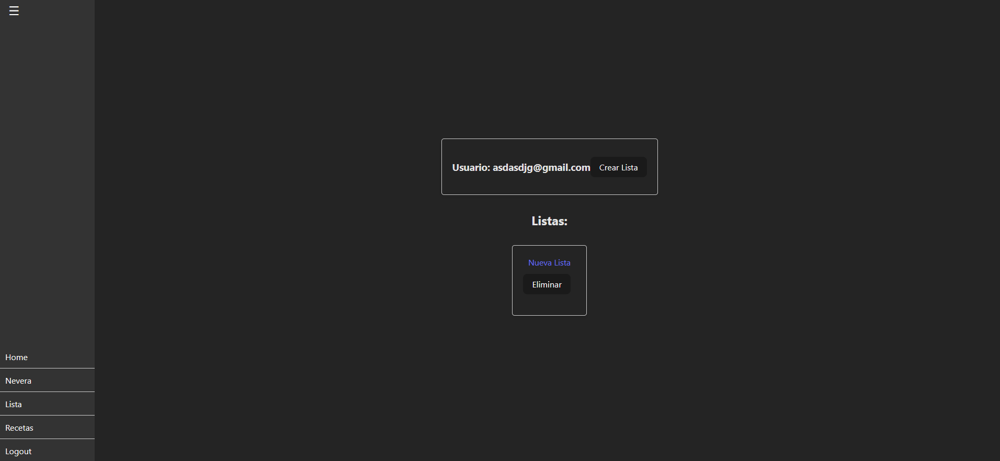
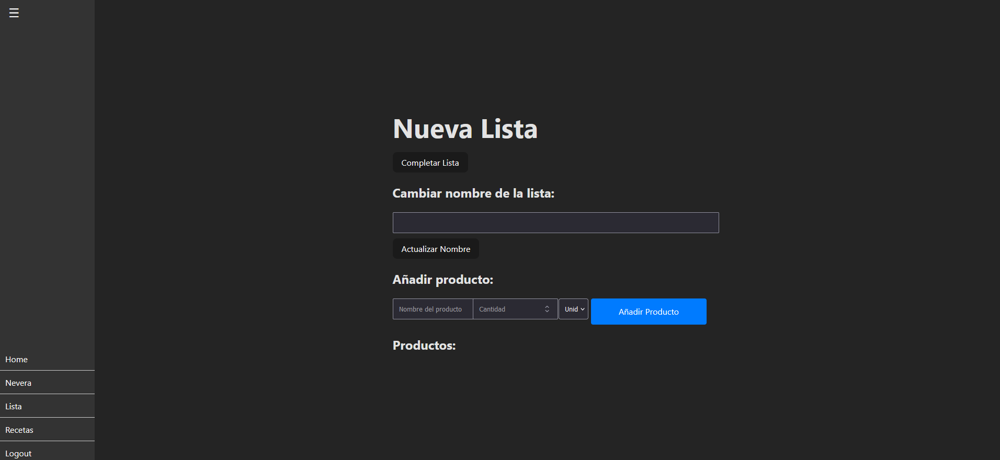
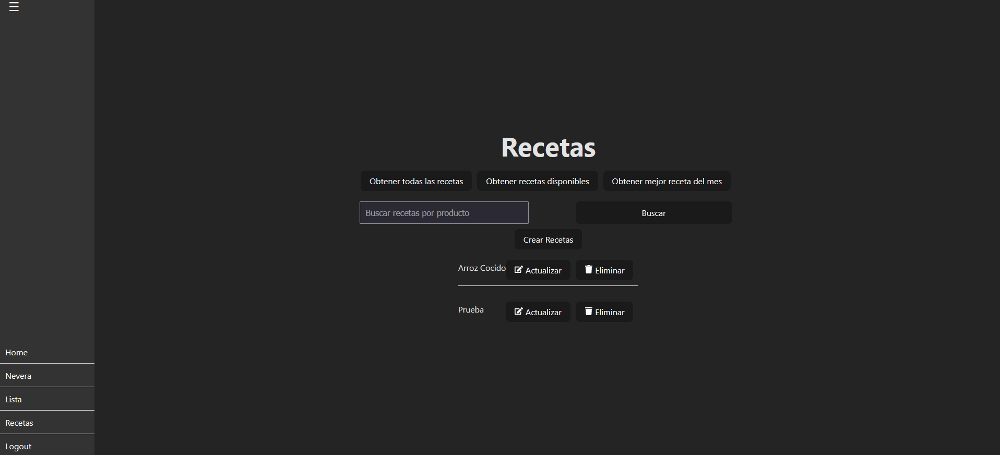
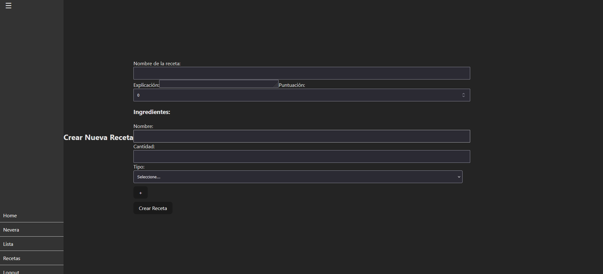

# Lista de la compra-(Front)

Esta es la parte del front de este proyecto, realizado para facilitar la creación de listas de la compra que se añadirían a una nevera virtual para tener mayor control de las necesidades de comprar en todo momento, aparte de poder compartir recetas.

## Tabla de contenidos
- [Instalación](#Instalación)
- [Uso](#Uso)
- [Por Hacer](#Por-hacer)
- [Construido con](#Construido-con)
- [Autor](#Autor)

## Instalación 🚀
Clonar el repositorio, luego en una terminal ejecutar npm i para instalar todos los módulos necesarios para el funcionamiento de la aplicación. Una vez hecho esto, se tiene que generar el archivo .env VITE_SERVER_URL="" y sustituir las comillas por el endpoint a usar. Hecho esto, usar el comando npm run dev.

## Uso 
Una vez inicializado Vite nos proporcionará una URL como: http://localhost:5173/
- Se nos mostrará la home:

En la barra lateral podremos ver la navegación
-La página de Registro:

-Y Login:

Lo primero será registrarnos para poder acceder al Login y así acceder a todo el contenido.
Una vez logueados tendremos las siguientes ventanas:

- La Home:

Aquí, además de ver la receta del mes, podremos ver las listas que tenemos pendientes.

- La nevera:

Donde podremos ver todos los ingredientes que tenemos guardados.

- Las listas:

Donde podremos ver nuestras listas ya creadas al hacer click en su nombre, eliminarlas al hacer click en el botón de eliminar o crear una nueva lista.

- En caso de hacer click en el nombre de una lista nos llevará a editar la lista:

Aquí podemos cambiar el nombre de la lista, ver los productos que tenemos en la lista o añadir nuevos productos a esta.

- Por último, tendremos la página de Recetas:

Aquí podremos ver las distintas recetas creadas por toda la comunidad, obtener las recetas según lo que tenemos en la nevera, la que se ha calificado como la mejor del mes o por último buscar recetas por un ingrediente.
Además, podremos editar las ya existentes con el botón actualizar, eliminarlas o crear nuevas recetas con el botón de Crear recetas.

- En la página de Crear Recetas o Actualizar:

Podremos crear nuevas recetas añadiendo un nombre a esta, explicando cómo se realiza y añadiendo los ingredientes que se usarán para llevar a cabo esta receta.

Por último, tendremos el Logout, que nos servirá para desconectarnos.

## Por hacer 
De momento me gustaría a futuro poder:
- Mejorar las CSS.
- Añadir que al realizar una receta, esta pueda consumir directamente los ingredientes de la nevera.
- En caso de agotar existencias de un producto, que se genere una lista de forma automática y se añadan para ir comprándolo.
- Que se puedan elegir productos que no queremos que se introduzcan en una lista.
- Que se pueda ver distintos precios de diferentes supermercados al hacer click en un producto de una lista.
- Una aplicación móvil.

## Construido con 🛠️

- React: 18.2.0
- React-dom: 18.2.0
- React-icons: 5.1.0
- React-router-dom: 6.22.3
- Vite: 5.2.0

## Autor ✒️

Jorge González Costa