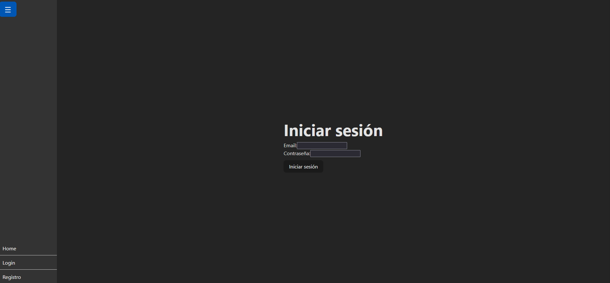

# Lista de la compra-(Front)
Esta es la parte del front de este proyecto , realizado para facilitar la creacion de listas de la compra que se añadirian a una nevera virtual para tener mayor control de las necesidades de comprar en todo momento aparte de poder compartir recetas

## Tabla de contenidos
- [Instalacion](#Instalacion)
- [Uso](#Uso)
- [PorHacer] (#PorHacer)
- [Construidocon] (#Construidocon)
- [Autor] (#Autor)

## Instalacion 🚀
Clonar el repositorio, luego en una terminal ejecutar npm i para instalar todos los modulos necesarios para el funcionamiento de la aplicacion una vez se tiene que generarel archivo .env VITE_SERVER_URL="" y substituir las comillas por el endpoint a usar, hecho esto usar el comando npm run dev

## Uso 
Una vez inicializado  vite nos proporcionarar una url como : http://localhost:5173/ y se nos mostrara la home  , en la barra lateral podremos ver la navegacion la paguina de Registro  y Login 

lo primero sera registrarnos para poder acceder al Login y asi acceder a todo el contenidos
una vez Logueados tendremos las siguientes ventanas
La Home  En la que ademas de ver la receta del mes, podremos ver las listas que tenemos pendientes

La nevera  Donde podremos ver todos los ingredientes que tenemos guardados

Las listas  Donde podremos ver nuestras listas ya creadas al hacer click en su nombre , eliminarlas al hacer click en el boton de eliminar o crear una nueva lista

En caso de hacer click en el nombre de una lista nos llevara a editar la lista   Aqui podemos cambiar el nombre de la lista, ver los productos que tenemos en la lista o añadir nuevos productos a esta 

Por ultimo tendremos la paguina de Recetas  Aqui podremos ver las distintas recetas creadas por toda la comunidad, obtener las recetas segun lo que tenemos en la nevera, la que se ha calificado como la mejor del mes o por ultimo buscar recetas por un ingrediete.
Ademas podremos editar las ya existentes con el boton actualizar, eliminarlas o Crear nuevas recetas con el boton de Crear recetas

En la paguina de Crear Recetas o Actualizar  Podremos Crear nuevas recetas Añadiendo un nombre a esta , explicando como se realiza, y añadiendo los ingredientes que se usaran para llevar a cabo esta receta.

Por ultimo tendremos el Logout , que nos servira para desconectarnos.

## Por hacer 
    De momento me gustaria a futuro poder:
    - Mejorar las css 
    - Añadir que al realizar una receta, que este pueda consumir directamente los ingredientes de la nevera
    - En Caso de agotar existencias de un producto , que se genere una lista de forma automatica y se añadan para ir comprandolo
    - Que se puedan elegir productos que no queremos que se introduzcan en una lista
    - Que se pueda ver distintos precios de diferentes supermercados al hazcer click en un producto de una lista
    - Una aplicacion movil 

## Construido con 🛠️

    -React: 18.2.0
    -React-dom: 18.2.0
    -React-icons: 5.1.0
    -React-router-dom: 6.22.3
    -Vite: 5.2.0

## Autor ✒️
    Jorge González Costa